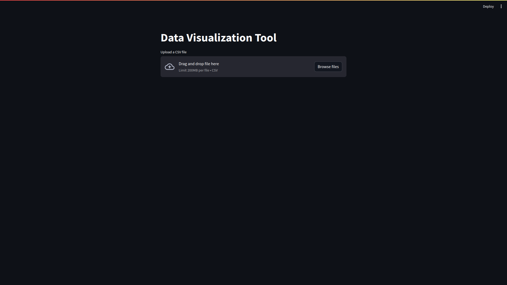
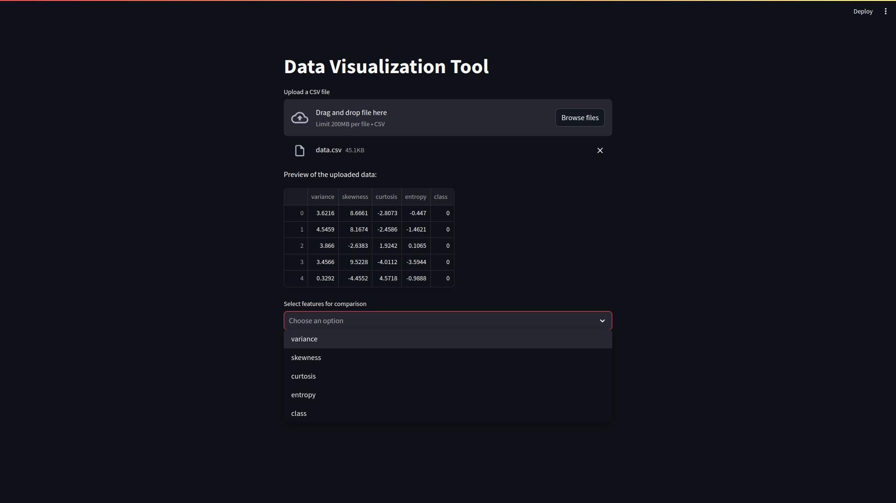
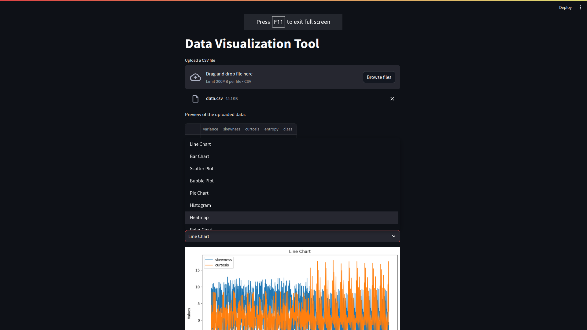
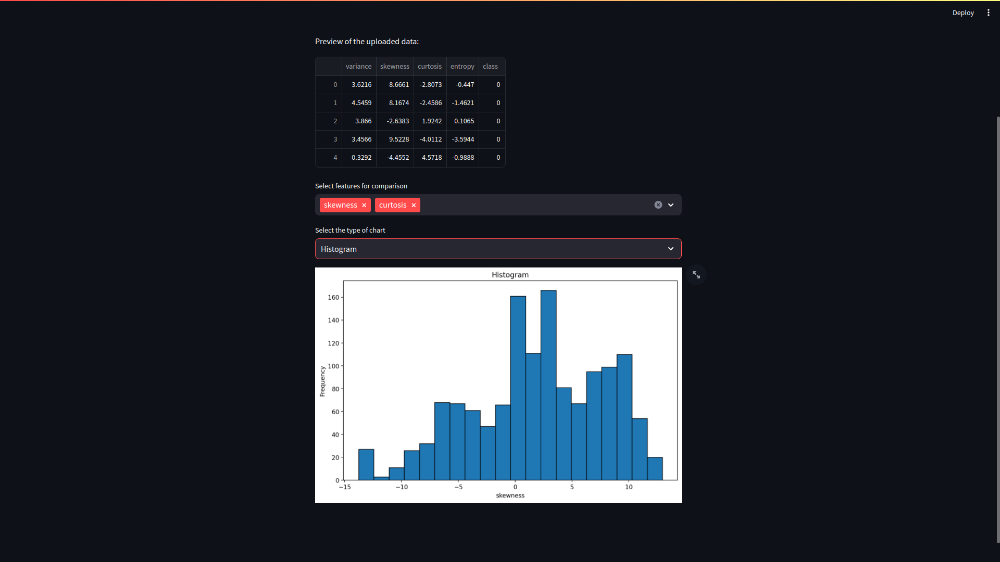
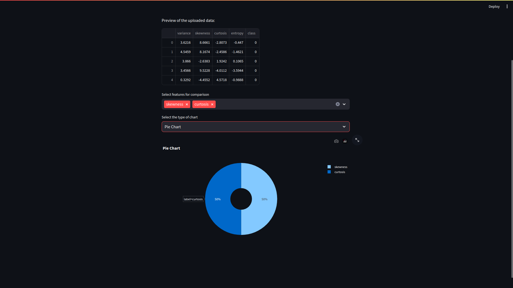

<p align="center">
  <a href="" rel="noopener">
 </a>
</p>

<h3 align="center">Data-Vizard</h3>

<div align="center">

[]()
[](/LICENSE)

</div>

---

<p align="center"> Data Vizard is a data visualization tool built using Python, Streamlit, Pandas, Matplotlib, and Plotly. It allows users to upload a CSV file and create intutive data visualizations just by selecting the features from the data.
    <br> 
</p>

## 📝 Table of Contents

- [About](#about)
- [Getting Started](#getting_started)
- [Usage](#usage)
- [Built Using](#built_using)
- [Authors](#authors)

## 🧐 About <a name = "about"></a>
Welcome to Data-Vizard, your go-to data visualization tool that empowers you to explore and present your data with ease. Developed with Python, Streamlit, and an ensemble of powerful libraries including Pandas, Matplotlib, and Plotly, Data-Vizard is your companion in unraveling insights from your datasets.

#### Unveiling the Magic 
- Seamless Data Upload: 

    With Data-Vizard, importing your data is as easy as waving a wand. Simply upload your CSV file, and let the magic begin.

- Tailored Feature Comparison:

    Selecting features for comparison has never been simpler. Data-Vizard empowers you to handpick the variables that matter most to you, enabling dynamic exploration of relationships within your dataset

- Chart Diversity: 

    From the simplicity of a Pie Chart to the complexity of a Heatmap, Data-Vizard offers a diverse range of chart types to captivate your audience. Whether you're uncovering distribution patterns with a Histogram or visualizing multidimensional data with a Bubble Plot, Data-Vizard transforms your raw data into captivating visual narratives.


## 🏁 Getting Started <a name = "getting_started"></a>

These instructions will get you a copy of the project up and running on your local machine for development and testing purposes.

### Prerequisites

To get started with this project on a local machine, you'll need following prerequisites:
1. Clone The Repository:- 
    ```
    git clone https://github.com/Abhishek-03113/Data-Vizard.git
    ```

2. Set up a virtual enviournment: - 
    ```
    python3 -m venv env

    # On linux use :- 
    source env/bin/activate 
    
    #On Windows use
    env\Scripts\activate
    ```
3. Install necessary python libraries: 
    ```
    pip install -r requirements.txt 
    ```

### Running the app locally 

Once the prerequisites processes are done, run the project by running the app script from the src directory
```
    streamlit run src/app.py
```
This will run the streamlit app on localhost

## 🎈 Usage <a name="usage"></a>
1. Run the app using ``` streamlit run src/app.py```

2. Upload the dataset. Example dataset is given in ```data/data.csv``` 

    

3. Select features from the data 

    

4. Select the Visualization from the given visualization charts and plots 

    </a>

5. You're Done, You'll get the visualization from selected features 

    </a>

    </a>


## ⛏️ Built Using <a name = "built_using"></a>

- [Streamlit](https://streamlit.io/) - Application Framework
- [Matplotlib](https://matplotlib.org/) - Data Vizualization Library
- [Ploty](https://plotly.com/) -  Data Vizualization Library
- [Pandas](https://pandas.pydata.org/) - Data Manipulation Library 

## ✍️ Authors <a name = "authors"></a>

- [Parth Solanke](https://github.com/parthsolanke) 
- [Abhishek Pawar](https://github.com/abhishek-03113) 
- [Shantanu Ekad ](https://github.com/ShantanuE7) 
- [Raj Nangare](https://github.com/RajNangare)

<hr>
